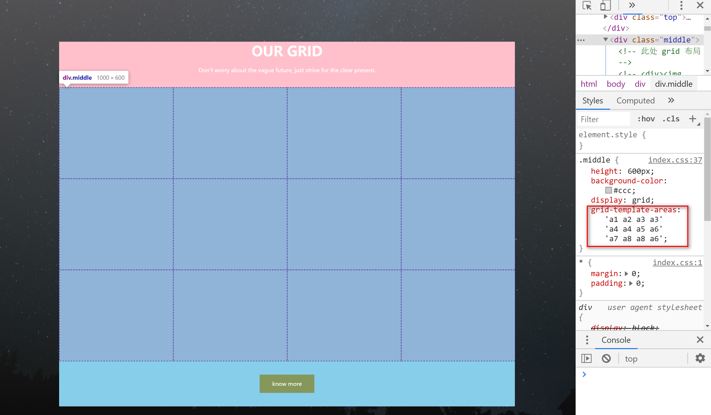
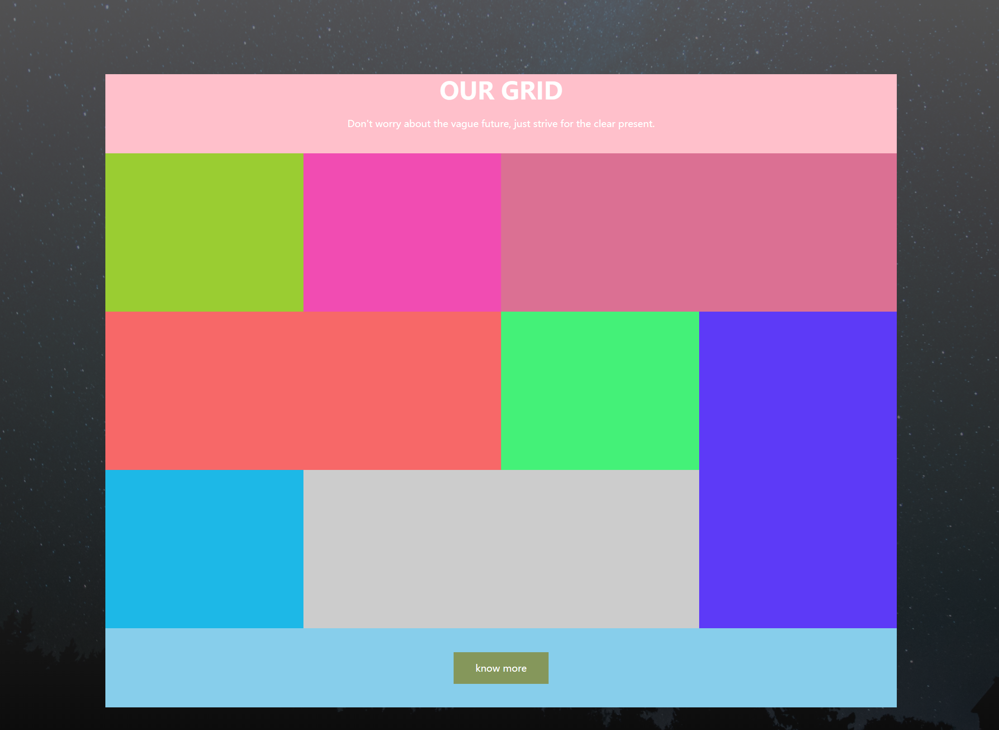
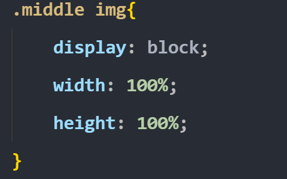

这篇文章不是一个教程文章，关于 `grid` 布局它的概念我不在此叙述，此文章主要是向大家展示 `grid` 的强大之处，以及为什么多数人接触它以后就爱不释手，相信大家看完这个案例会对他有新的认识。好了，那么废话不多说，先上一张效果图

这个页面咱们用简单的几句`grid` 代码就能完成，就算零基础也能学会。

首先这个页面我是把中间有内容这部分用一个大盒子( 此处加的绿色背景 )装着的如图所示 

我把这个盒子分为上(红色框) 中 (紫或者粉色框) 下(黄色框)三个部分，由于此处 `div` 本身就是从上到下排列，所以没有用到其他布局，只是给上下两个盒子加了一个高度和背景色，

此处上下两个盒子的样式我就不再多说，都是常规样式，并没有使用到 grid 布局。咱们今天的重点在中间的 `class="middle"` 这个盒子，我给他加了一个高度和一个背景色，咱们看看效果图

好，接下来就是重要的一步，让他变成 `grid` 容器，我们给他加上一个 `display:grid;` 看看效果

此时已经能看到内部有一些虚线网格，这并不是我后期加的效果图，是咱们加上 `display:grid;` 后浏览器自动呈现的，当然此时我是在`.middle` 里面放了 8个 空的 `div`

然后接下来咱们要使用 `grid-template-area` 这个属性，这个属性是用来给咱们的容器划分区域，咱们看看加上有什么变化

可以看到我们的容器已经是 12 宫格，我使用的 `grid-template-area` 属性里面大家能看到有两个 `a3、a6、a8`, 这是因为待会我的图片需要横跨这个相同的区域。下图是我们的区域划分图

好， 此时我们需要让每一个`div` 占有不同的区域，怎么做呢，我们会使用到 `grid-area` 属性来占有自己的区域，现在我先给前三个`div` 加上这个属性

加下来给每一个 `div` 都加上这个属性和背景色，效果图如下

到目前为止看着没什么问题，那么咱们开心的把背景色注释了，在每一个 `div` 里面加一张图片，`CSS` 样式里面给每一张图片加了宽高`100%` 其他样式并没有修改，咱们看看效果图把

emmm...看起来好像没啥问题，但是又像有点问题，咱们不能这么容易就满足是吧，咱们的图片已经把网格撑大了，怎么办呢，咱们给图片外面那层 `div` 加一个一个老司机属性 `overflow:hidden;` 看看

OK 现在看起来没问题了，咱们再加两个属性稍微修饰一下，`grid-column-gap` 和 `grid-column-gap` 稍微添加一点列间距和行间距，`grid-gap` 是他们的简写形式，咱们写上看看效果。

 

好勒，咱们的效果完美达成，这里只用到 `grid` 中的几个属性，已经能够完成精美的页面了~

​																																				2020-03-07

​																																				xiao
